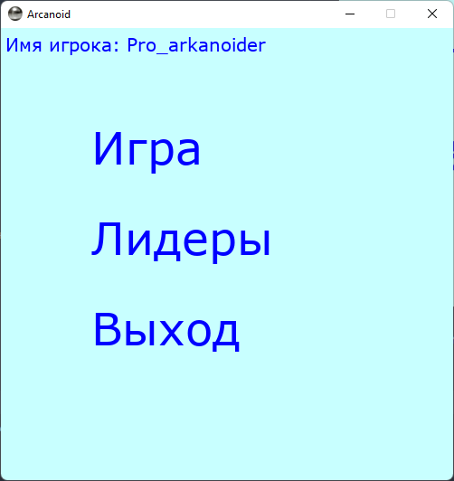
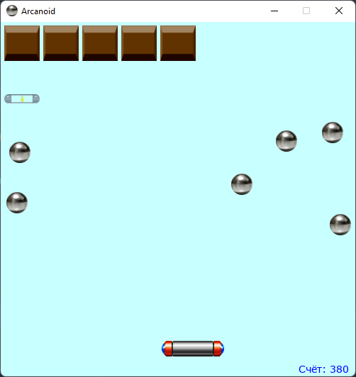
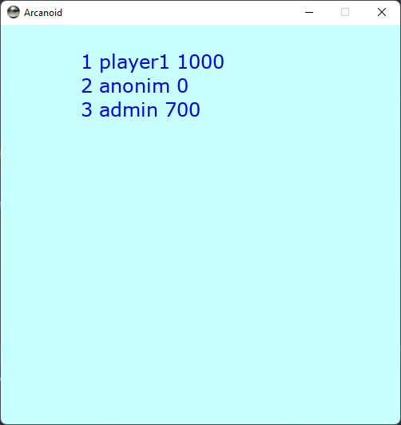

# Арканоид
### Как играть
* Запустив игру, игроку необходимо написать свое имя или никнейм, это можно сделать сразу начав печатать.

* Пункты меню.
  * "Игра" - для запуска игрового процесса.
  * "Лидеры" - для просмотра игроков и их результатов.
  * "Выход" - для выхода из игры.
* После начала игрового процесса, задача игрока разрушить все блоки.
* Из блоков могу выпадать бустеры для для шарика или дополнительные очки.
* В случаи побуды, результат заносится в таблицу лидеров.
* Заходя каждый раз в пункт "Игра" пользователю генирируется новый уровень.

### Особенности
* Реализована одиночная игра с рандомной генерацией уровня.
* Реализованны бустеры  (ускорение/замедление шарика, разтроение шарика, дополнительные 100 очков) рандомно генерируемые в блоках.
* Во время игры идёт подсчёт очков.
* Проработанное поведение шариков при столкновении с платформой и блоками и также их углами, столкнопения со стенками и столкновения шариков друг с другом.
* В случае если уровень пройден, ваше имя попадает в таблицу лидеров, если вы уже там есть, то результаты суммируются.

### Структура файлов

      |- main.py - программный код приложения

      |- classes - папка с классами

      |- images - папка с файлами изображений

      |- sound - папка со звуковыми файлами

      |- leader_board - текстовые файлы таблицей лидеров

### Иерархия классов
* Класс ***Area***
Класс родитель имеющий методы для отрисовки и заливки и отслеживания касаний объектов.
* Класс ***Label*** наследник ***Area***
Позволяет создавать надписи в игре.
* Класс ***Picture*** наследник ***Area***
Позволяет создавать объекты с загружаемым изображением.
* Класс ***Brick*** наследник ***Picture***
Класс описывающий блоки которые необходимо разрушить.
* Класс ***Ball*** наследник ***Picture***
Класс описывающий шарики.
* Класс ***Map***
Класс описывающий игровое поле.

### Функции
* main(scr)
Основная функция игры.
* start(scr)
Функция для запуска игорового процесса.
* statistic(scr)
Функция для отображения доски лидеров.
* move_platform(platform, move_right, move_left)
Функция для передвижения платформы.
* detect_collision(dx, dy, ball, rect)
Функция для расчётов направления движения шарика после его столкновения с объектом.
* lose_or_win(balls, map)
Функция для определения победы или проигрыша.
* write_result(name, score)
Функиця для записи результатов в таблицу лидеров.
### Требования
Все требования в requirements.txt

### Запуск
Запустить файл main.py

Ввести имя или никнейм

Выбрать "Играть"

Проходим уровень

возвращаемся на главный экран
Заходим в таблицу лидеров

В любой момент можно завершить игру нажав крестик на окне с игрой.

### TODO
Уровни сложности в зависимости от размера окна
